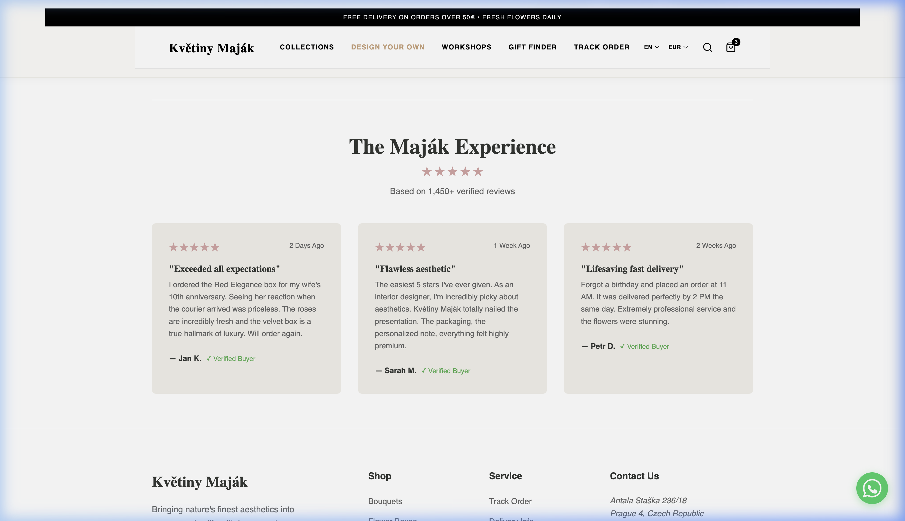
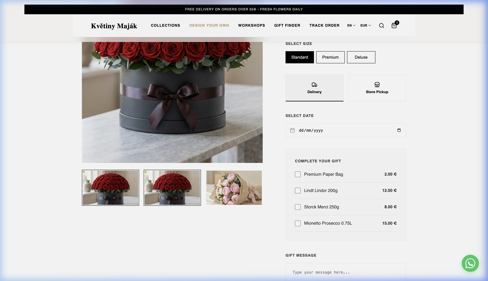
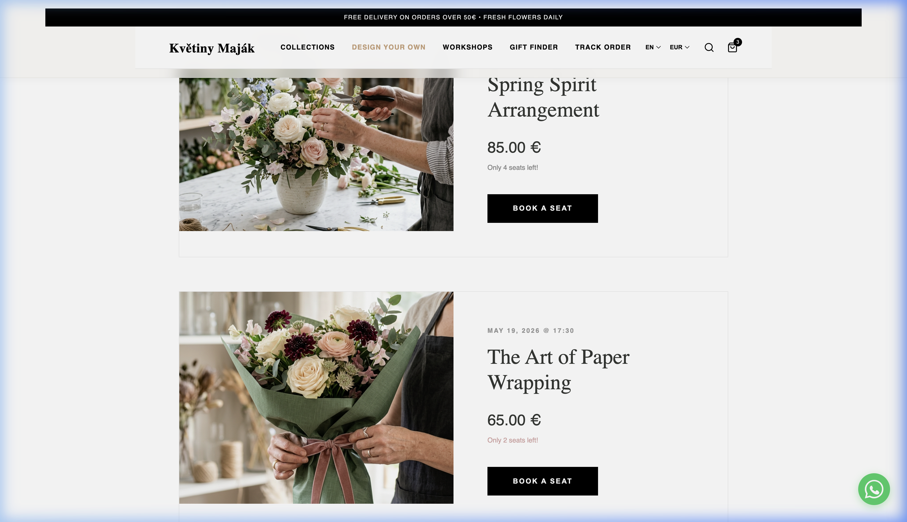
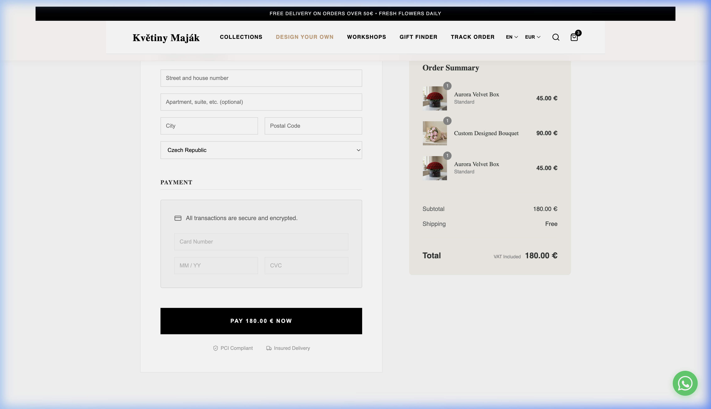

# 🌸 Květiny Maják - Premium Flower Shop Experience

A state-of-the-art e-commerce platform for Prague's finest flower shop, built with React, Vite, and modern web technologies. This project transforms the traditional floral shopping experience into a cinematic, high-performance digital journey.

## ✨ Key Features

- **Cinematic UX**: High-end animations and smooth transitions using custom scroll reveal hooks and modern CSS.
- **Dynamic Product Experience**: Real-time updates for flower arrangements, colors, and sizes.
- **Interactive Workshops**: A dedicated space for floral arrangement classes and community events.
- **AI-Powered Gift Finder**: A gamified quiz to help customers find the perfect bouquet for any occasion.
- **Multi-language Support**: Full localization for English and Czech (i18next).
- **Sound-Enhanced UI**: Subtle auditory feedback for a more immersive and premium user experience.
- **Premium Admin Dashboard**: Full control over products, orders, and customer data.

## 📸 Screenshots

### 🏠 Cinematic Homepage


### 💐 Product Detail & Customization


### 🏫 Floral Workshops


### 🛒 Seamless Checkout


## 🛠 Tech Stack

- **Frontend**: React 18, Vite
- **Styling**: Vanilla CSS (Premium Custom Design System)
- **Animations**: Custom ScrollReveal Hooks, CSS Transitions
- **State Management**: React Hooks, Context API
- **Internationalization**: i18next
- **Routing**: React Router v6

## 🚀 Getting Started

1. Clone the repository:
   ```bash
   git clone https://github.com/eminaydin19/flower-shop-website.git
   ```
2. Install dependencies:
   ```bash
   npm install
   ```
3. Run the development server:
   ```bash
   npm run dev
   ```

---
Developed by [Emin Aydin](https://github.com/eminaydin19)
